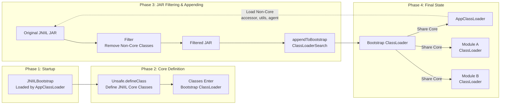
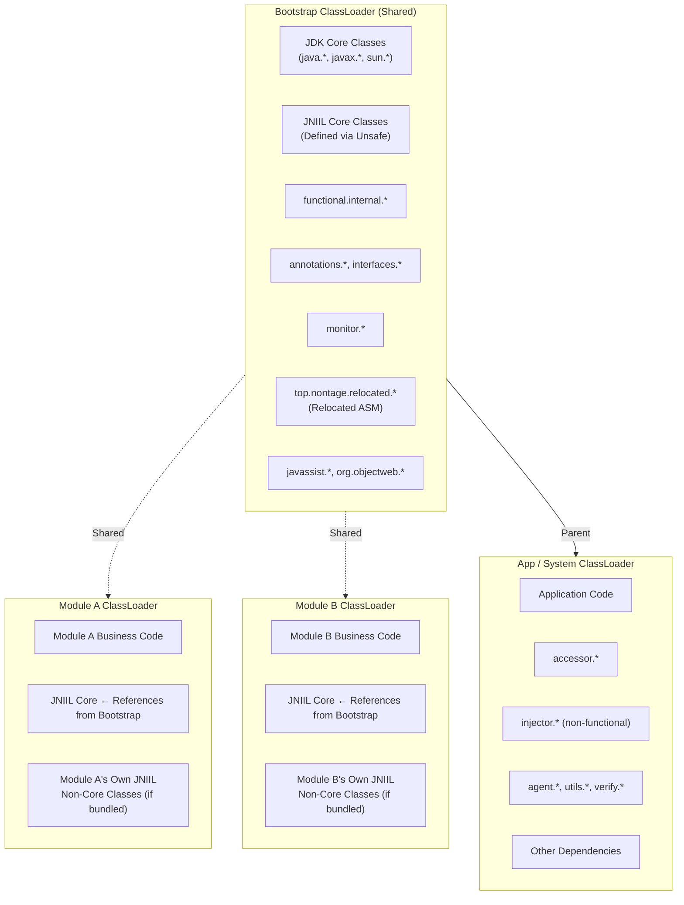
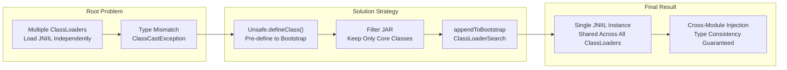

# JNIIL Bootstrap ClassLoader Deployment

## Overview

In modular architectures (OSGi, JPMS, custom classloader isolation), each module has its own ClassLoader. JNIIL injected across module boundaries fails because:

| Scenario                             | Problem                                  |
|--------------------------------------|------------------------------------------|
| Module A has JNIIL, Module B doesn't | `NoClassDefFoundError` in B              |
| Both modules bundle JNIIL            | Two copies loaded → `ClassCastException` |
| Bidirectional injection              | Type mismatch, cannot cast               |

**Root cause:** JNIIL core classes are loaded multiple times by different ClassLoaders.

**Solution:** Put JNIIL core into Bootstrap ClassLoader (parent of all ClassLoaders) → single shared instance across entire JVM.

---

## Bootstrap Flow

```mermaid
flowchart TD
    Start(["Start: Call JNIILBootstrap.install()"]) --> CheckInst{Instrumentation<br/>already set?}
    CheckInst -->|Yes| Done([Complete])
    CheckInst -->|No| Mode{Select Mode}
    
    Mode -->|ATTACH_API| AttachSelf[Dynamic Self-Attach<br/>VirtualMachine.attach]
    Mode -->|NATIVE| NativeGet[Get Instrumentation<br/>via JvmContext]
    
    AttachSelf --> GenAgent[Generate Temp Agent JAR<br/>TempAgent.class]
    GenAgent --> LoadAgent[Load Agent<br/>Obtain Instrumentation]
    LoadAgent --> GotInst[Instrumentation Instance<br/>Acquired]
    NativeGet --> GotInst
    
    GotInst --> CheckLoad{JNIIL already<br/>in Bootstrap?}
    CheckLoad -->|Yes| Done
    CheckLoad -->|No| DefineCore[Unsafe.defineClass<br/>Define Core Classes to Bootstrap]
    
    DefineCore --> DefineDetail["Define Classes:<br/>• JNIIL<br/>• JNIIL$InjectionOutputConfig<br/>• MethodInfo<br/>• InsnContext"]
    
    DefineDetail --> LocateJar[Locate JNIIL JAR]
    LocateJar --> LocateDetail["Search Order:<br/>1. CodeSource of JNIILBootstrap.class<br/>2. .m2/repository<br/>3. Gradle cache"]
    
    LocateDetail --> FilterJar[Filter JAR Contents]
    FilterJar --> FilterDetail["Keep:<br/>• functional.internal.*<br/>• annotations.*<br/>• interfaces.*<br/>• top.nontage.relocated.*<br/>• javassist.*<br/>• org.objectweb.*<br/><br/>Remove:<br/>• accessor.*<br/>• injector.* (non-functional)<br/>• agent.*<br/>• utils.*<br/>• verify.*"]
    
    FilterDetail --> AppendBootstrap[instrumentation.appendToBootstrapClassLoaderSearch<br/>Append Filtered JAR]
    
    AppendBootstrap --> HandleUnsafe{JDK23+<br/>&& hiddenWarning?}
    HandleUnsafe -->|Yes| PatchUnsafe[UnsafeTransformer<br/>Modify Unsafe class<br/>Bypass memory access restrictions]
    HandleUnsafe -->|No| SetInst
    
    PatchUnsafe --> SetInst["Set Instrumentation<br/>JNIIL.setInstrumentation()"]
    
    SetInst --> Verify["Verify & Initialize<br/>JNIILPokaYoke.verifyAndInitialize()"]
    Verify --> CheckUnsafe{Failed &&<br/>JDK23+?}
    CheckUnsafe -->|Yes| ThrowDeny[Throw Unsafe Restricted Exception<br/>Suggest forceEnableUnsafe]
    CheckUnsafe -->|No| Done
    
    ThrowDeny --> Done
    
    Done --> End([End])
```

---

## ClassLoader Architecture Flow

---

## ClassLoader Responsibility Matrix

---

## Key Design Decisions Flowchart

---

## What's in Each ClassLoader

### Bootstrap ClassLoader

- JDK core classes (`java.*`, `javax.*`, `sun.*`)
- `top.nontage.jniil.JNIIL` (via Unsafe)
- `top.nontage.jniil.JNIIL$InjectionOutputConfig` (via Unsafe)
- `top.nontage.jniil.injector.functional.internal.*`
- `top.nontage.jniil.annotations.*`
- `top.nontage.jniil.interfaces.*`
- `top.nontage.jniil.monitor.*`
- `top.nontage.relocated.*` (relocated ASM)
- `javassist.*`
- `org.objectweb.*` (original ASM)

### Default / App ClassLoader

- `top.nontage.jniil.accessor.*`
- `top.nontage.jniil.injector.*` (non-functional parts)
- `top.nontage.jniil.agent.*`
- `top.nontage.jniil.utils.*`
- `top.nontage.jniil.verify.*`
- Application code and dependencies

### Module ClassLoaders (A, B, ...)

- Module-specific code
- References JNIIL core from Bootstrap (shared)
- Own copy of JNIIL non-core classes if bundled

---

## Key Design Decisions

### Why `Unsafe.defineClass()` before `appendToBootstrapClassLoaderSearch()`?

`appendToBootstrapClassLoaderSearch()` only affects **future** class loading. If JNIIL was already loaded by a child ClassLoader, it won't be reloaded into Bootstrap. `Unsafe.defineClass()` forces JNIIL into Bootstrap first, ensuring the shared instance exists.

### Why `inject(Object)` instead of `inject(Injectable)`?

If parameter is `Injectable`, method signature resolution requires loading the `Injectable` interface. In Bootstrap environment, `Injectable` may not be in Bootstrap's search path → `NoClassDefFoundError`. Using `Object` defers type checking until method body executes.

### Why doesn't `InjectionUtil` cache `Instrumentation` in a static field?

Static fields bind at class initialization time, triggering premature class loading. This risks JNIIL being loaded by a child ClassLoader. Instead, each method call fetches `Instrumentation` from `JNIIL.getInstrumentation()` at runtime.

---

## Summary

- **Problem:** Multiple ClassLoaders → Multiple JNIIL copies → Type mismatch
- **Solution:** Put JNIIL core in Bootstrap → Single shared instance
- **How:** `Unsafe.defineClass()` + Filtered JAR + `appendToBootstrapClassLoaderSearch()`
- **Result:** All ClassLoaders share the same JNIIL core
- **Key:** `install()` must be called **BEFORE** any JNIIL API usage